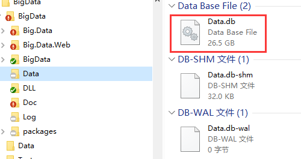
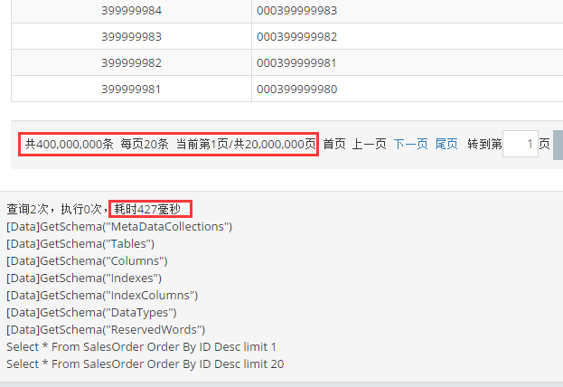
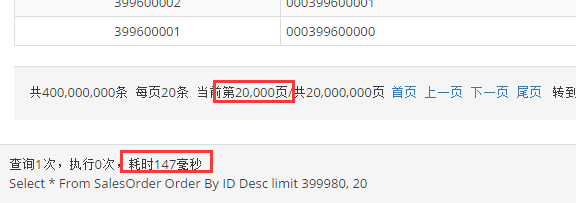
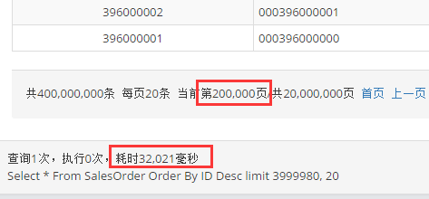
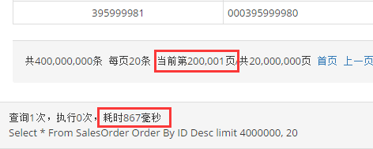
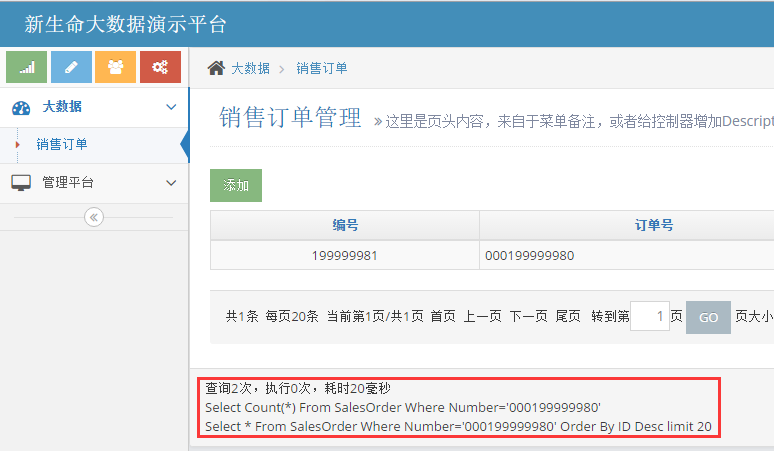
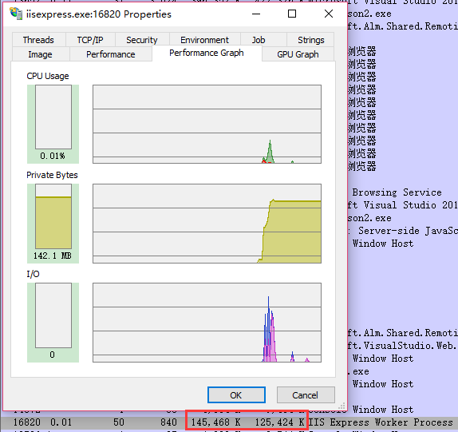

## SQLite单表4亿订单，大数据测试  
`SQLite`作为嵌入式数据库的翘楚，广受欢迎！  
新生命团队自2010年以来，投入大量精力对`SQLite`进行学习研究，成功应用于各系统非致命数据场合。  

### SQLite极致性能
+ 关闭同步，Synchronous=Off，提升性能。添删改操作时不必同步等待写入磁盘，操作系统会延迟若干毫秒批量写入  
+ 设置WAL模式，Journal Mode=WAL，减少锁定。写入向前日志模式，避免多线程访问时锁定数据库，写入时不必使用排它锁影响其它线程读取，而是把事务操作写入到WAL文件中，延迟合并  
+ 加大缓存，Cache Size=5000，提升性能。操作系统通过文件映射MapFile把整个数据库文件映射进入内存，实际查询时会把用到数据所在附近页预先加载进入缓存，极大提升查询性能  
+ 插入速度 5000~16000tps，依赖CPU，HDD/SSD差别不大，主要受限于SQLite.Data.dll的Prepare  
+ 查询速度 非首次查询，缓存命中以后，索引查询基本上都是毫秒级。数据库较大则相应加大缓存，速度不变。  
+ 查记录数 单表数据超过一千万行以后，尽量不要使用Select Count，否则可能需要十几秒到半分钟的样子才能返回。NewLife.XCode封装了'Meta.Count'  

当然，SQLite不适合多线程高并发写入，多线程高并发读取倒是非常不错。  
因为数据库就在进程内，高并发读取一般比其它RDS要快一大截。  
总的来说，SQLite数据库甭管多少数据多大库文件，只要配置得当，内存管够，性能不是太大问题！  

### SQLite大数据
为了验证SQLite的性能巅峰，我们来做一个大数据测试。  
模拟每天4亿票销售订单，分表分库，每天一个数据库文件，有订单号、部门节点、时间等。  

1, Test项目生成4亿行订单数据，主键自增ID，订单号建立索引，文件大小26.5G  

2, Web项目，魔方+XCode，首次查询较慢，约427毫秒，需要预热  
不同机器的首次查询时间偏差比较大，最大可能达到几秒钟  
本机第一次启动该项目时，魔方需要从公网下载SQLite驱动文件以及样式资源文件  

3, 第二页，99毫秒，操作系统文件映射缓存生效  

4, 第20000页，147毫秒，系统缓存依然生效  

5, 第200000页，32021毫秒，距离太远，文件系统缓存没有命中  

6, 第200001页，867毫秒，缓存命中  

6, 查询一个中间订单号000199999980，20毫秒，索引命中  
显然，只要有索引，多大数据都不怕  

7, 本地内存占用150M。虽然整个数据库26.5G，但操作系统只会加载需要部分  
对于重要程度不是特别高的场合，可以大量使用SQLite库保存历史数据，平时用不到的时候只占硬盘，不占内存  

### SQLite在云端
http://bigdata.newlifex.com/Admin
admin/admin

+ 租用阿里云最低配置ECS，单核1G，1M带宽，每年300块，每天九毛钱
+ 部署BigData项目到ECS，访问正常

### 源码及数据库
大数据源码 http://git.newlifex.com/Stone/BigData
大数据镜像 https://github.com/nnhy/BigData
4亿订单数据 http://pan.baidu.com/s/1skZJ2ih
2亿订单数据 http://pan.baidu.com/s/1bo9NFFx
数据库下载后，解压缩得到Data.db，拷贝到Web并排的Data里面，Data里面还有一个Membership.db