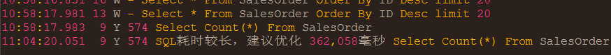

## SQLite单表4亿订单，大数据测试  
`SQLite`作为嵌入式数据库的翘楚，广受欢迎！  
新生命团队自2010年以来，投入大量精力对`SQLite`进行学习研究，成功应用于各系统非致命数据场合。  

### SQLite极致性能
+ 关闭同步，Synchronous=Off，提升性能。添删改操作时不必同步等待写入磁盘，操作系统会延迟若干毫秒批量写入  
+ 设置WAL模式，Journal Mode=WAL，减少锁定。写入向前日志模式，避免多线程访问时锁定数据库，写入时不必使用排它锁影响其它线程读取，而是把事务操作写入到WAL文件中，延迟合并  
+ 加大缓存，Cache Size=5000，提升性能。操作系统通过文件映射MapFile把整个数据库文件映射进入内存，实际查询时会把用到数据所在附近页预先加载进入缓存，极大提升查询性能  
+ 插入速度 5000~16000tps，依赖CPU，HDD/SSD差别不大，主要受限于SQLite.Data.dll的Prepare  
+ 查询速度 非首次查询，缓存命中以后，索引查询基本上都是毫秒级。数据库较大则相应加大缓存，速度不变。  
+ 查记录数 单表数据超过一千万行以后，尽量不要使用Select Count，否则可能需要十几秒到半分钟的样子才能返回。NewLife.XCode封装了'Meta.Count'  

当然，SQLite不适合多线程高并发写入，多线程高并发读取倒是非常不错。  
因为数据库就在进程内，高并发读取一般比其它RDS要快一大截。  
总的来说，SQLite数据库甭管多少数据多大库文件，只要配置得当，内存管够，性能不是太大问题！  

### SQLite大数据
为了验证SQLite的性能巅峰，我们来做一个大数据测试。  
模拟每天4亿票销售订单，分表分库，每天一个数据库文件，有订单号、部门节点、时间等。  

1, Test项目生成4亿行订单数据，主键自增ID，订单号建立索引，文件大小26.5G  

2, Web项目，魔方+XCode，首次查询较慢，约427毫秒，需要预热  
不同机器的首次查询时间偏差比较大，最大可能达到几秒钟  
本机第一次启动该项目时，魔方需要从公网下载SQLite驱动文件以及样式资源文件  

3, 第二页，99毫秒，操作系统文件映射缓存生效  

4, 第20000页，147毫秒，系统缓存依然生效  

5, 第200000页，32021毫秒，距离太远，文件系统缓存没有命中  

6, 第200001页，867毫秒，缓存命中  

7, 查询一个中间订单号000199999980，20毫秒，索引命中  
显然，只要有索引，多大数据都不怕  

8, 本地内存占用150M。虽然整个数据库26.5G，但操作系统只会加载需要部分  
对于重要程度不是特别高的场合，可以大量使用SQLite库保存历史数据，平时用不到的时候只占硬盘，不占内存  

9, 记录数Select Count，362058毫秒，约6分钟，超级慢  

### SQLite在云端
http://bigdata.newlifex.com/Admin
admin/admin

+ 租用阿里云最低配置ECS，单核1G，1M带宽，每年300块，每天九毛钱
+ 部署BigData项目到ECS，访问正常

### 源码及数据库
大数据源码 http://git.newlifex.com/Stone/BigData  
大数据镜像 https://github.com/nnhy/BigData  
4亿订单数据 http://pan.baidu.com/s/1skZJ2ih  
2亿订单数据 http://pan.baidu.com/s/1bo9NFFx  
数据库下载后，解压缩得到Data.db，拷贝到Web并排的Data里面，Data里面还有一个Membership.db  

## 新生命项目矩阵
各项目默认支持net9.0/netstandard2.1/netstandard2.0/net4.62/net4.5，旧版（2024.0801）支持net4.0/net2.0  

|                               项目                               | 年份  | 说明                                                                                        |
| :--------------------------------------------------------------: | :---: | ------------------------------------------------------------------------------------------- |
|                             基础组件                             |       | 支撑其它中间件以及产品项目                                                                  |
|          [NewLife.Core](https://github.com/NewLifeX/X)           | 2002  | 核心库，日志、配置、缓存、网络、序列化、APM性能追踪                                         |
|    [NewLife.XCode](https://github.com/NewLifeX/NewLife.XCode)    | 2005  | 大数据中间件，单表百亿级，MySql/SQLite/SqlServer/Oracle/PostgreSql/达梦，自动分表，读写分离 |
|      [NewLife.Net](https://github.com/NewLifeX/NewLife.Net)      | 2005  | 网络库，单机千万级吞吐率（2266万tps），单机百万级连接（400万Tcp长连接）                     |
| [NewLife.Remoting](https://github.com/NewLifeX/NewLife.Remoting) | 2011  | 协议通信库，提供CS应用通信框架，支持Http/RPC通信框架，高吞吐，物联网设备低开销易接入        |
|     [NewLife.Cube](https://github.com/NewLifeX/NewLife.Cube)     | 2010  | 魔方快速开发平台，集成了用户权限、SSO登录、OAuth服务端等，单表100亿级项目验证               |
|    [NewLife.Agent](https://github.com/NewLifeX/NewLife.Agent)    | 2008  | 服务管理组件，把应用安装成为操作系统守护进程，Windows服务、Linux的Systemd                   |
|     [NewLife.Zero](https://github.com/NewLifeX/NewLife.Zero)     | 2020  | Zero零代脚手架，基于NewLife组件生态的项目模板NewLife.Templates，Web、WebApi、Service        |
|                              中间件                              |       | 对接知名中间件平台                                                                          |
|    [NewLife.Redis](https://github.com/NewLifeX/NewLife.Redis)    | 2017  | Redis客户端，微秒级延迟，百万级吞吐，丰富的消息队列，百亿级数据量项目验证                   |
| [NewLife.RocketMQ](https://github.com/NewLifeX/NewLife.RocketMQ) | 2018  | RocketMQ纯托管客户端，支持Apache RocketMQ和阿里云消息队列，十亿级项目验                     |
|     [NewLife.MQTT](https://github.com/NewLifeX/NewLife.MQTT)     | 2019  | 物联网消息协议，MqttClient/MqttServer，客户端支持阿里云物联网                               |
|      [NewLife.IoT](https://github.com/NewLifeX/NewLife.IoT)      | 2022  | IoT标准库，定义物联网领域的各种通信协议标准规范                                             |
|   [NewLife.Modbus](https://github.com/NewLifeX/NewLife.Modbus)   | 2022  | ModbusTcp/ModbusRTU/ModbusASCII，基于IoT标准库实现，支持ZeroIoT平台和IoTEdge网关            |
|  [NewLife.Siemens](https://github.com/NewLifeX/NewLife.Siemens)  | 2022  | 西门子PLC协议，基于IoT标准库实现，支持IoT平台和IoTEdge                                      |
|      [NewLife.Map](https://github.com/NewLifeX/NewLife.Map)      | 2022  | 地图组件库，封装百度地图、高德地图、腾讯地图、天地图                                        |
|    [NewLife.Audio](https://github.com/NewLifeX/NewLife.Audio)    | 2023  | 音频编解码库，PCM/ADPCMA/G711A/G722U/WAV/AAC                                                |
|                             产品平台                             |       | 产品平台级，编译部署即用，个性化自定义                                                      |
|         [Stardust](https://github.com/NewLifeX/Stardust)         | 2018  | 星尘，分布式服务平台，节点管理、APM监控中心、配置中心、注册中心、发布中心                   |
|           [AntJob](https://github.com/NewLifeX/AntJob)           | 2019  | 蚂蚁调度，分布式大数据计算平台（实时/离线），蚂蚁搬家分片思想，万亿级数据量项目验证         |
|      [NewLife.ERP](https://github.com/NewLifeX/NewLife.ERP)      | 2021  | 企业ERP，产品管理、客户管理、销售管理、供应商管理                                           |
|         [CrazyCoder](https://github.com/NewLifeX/XCoder)         | 2006  | 码神工具，众多开发者工具，网络、串口、加解密、正则表达式、Modbus、MQTT                      |
|           [EasyIO](https://github.com/NewLifeX/EasyIO)           | 2023  | 简易文件存储，支持分布式系统中文件集中存储。                                                |
|           [XProxy](https://github.com/NewLifeX/XProxy)           | 2005  | 产品级反向代理，NAT代理、Http代理                                                           |
|        [HttpMeter](https://github.com/NewLifeX/HttpMeter)        | 2022  | Http压力测试工具                                                                            |
|         [GitCandy](https://github.com/NewLifeX/GitCandy)         | 2015  | Git源代码管理系统                                                                           |
|          [SmartOS](https://github.com/NewLifeX/SmartOS)          | 2014  | 嵌入式操作系统，完全独立自主，支持ARM Cortex-M芯片架构                                      |
|          [SmartA2](https://github.com/NewLifeX/SmartA2)          | 2019  | 嵌入式工业计算机，物联网边缘网关，高性能.NET8主机，应用于工业、农业、交通、医疗             |
|                          FIoT物联网平台                          | 2020  | 物联网整体解决方案，建筑、环保、农业，软硬件及大数据分析一体化，单机十万级点位项目验证      |
|                        UWB高精度室内定位                         | 2020  | 厘米级（10~20cm）高精度室内定位，软硬件一体化，与其它系统联动，大型展厅项目验证             |

## 新生命开发团队
  

新生命团队（NewLife）成立于2002年，是新时代物联网行业解决方案提供者，致力于提供软硬件应用方案咨询、系统架构规划与开发服务。  
团队主导的80多个开源项目已被广泛应用于各行业，Nuget累计下载量高达400余万次。  
团队开发的大数据中间件NewLife.XCode、蚂蚁调度计算平台AntJob、星尘分布式平台Stardust、缓存队列组件NewLife.Redis以及物联网平台FIoT，均成功应用于电力、高校、互联网、电信、交通、物流、工控、医疗、文博等行业，为客户提供了大量先进、可靠、安全、高质量、易扩展的产品和系统集成服务。  

我们将不断通过服务的持续改进，成为客户长期信赖的合作伙伴，通过不断的创新和发展，成为国内优秀的IoT服务供应商。  

`新生命团队始于2002年，部分开源项目具有20年以上漫长历史，源码库保留有2010年以来所有修改记录`  
网站：https://newlifex.com  
开源：https://github.com/newlifex  
QQ群：1600800/1600838  
微信公众号：  
  
